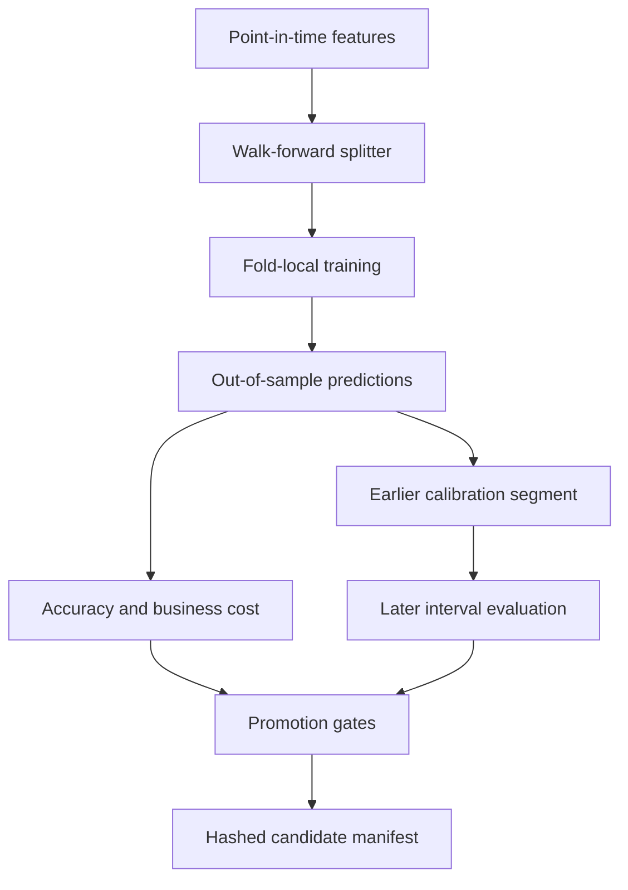

# Financial Time-Series Forecasting Platform

A correctness-first reference platform for **time-ordered model evaluation, probabilistic uncertainty and governed model promotion**. It uses a deterministic synthetic market with changing volatility and autocorrelation so the repository can prove its mechanics without implying that a synthetic Sharpe ratio is an investable result.

This is no longer a notebook-shaped “train an LSTM and plot the test set” project. The package makes temporal boundaries, baselines, uncertainty calibration, business costs and release decisions explicit and testable.

## What is implemented

| Concern | Implementation | Failure guarded |
|---|---|---|
| Validation | Expanding or capped rolling walk-forward folds | Random split leakage |
| Label overlap | Configurable purge gap | Train/test boundary contamination |
| Baselines | Zero return, historical mean, seasonal naive | Beating no meaningful comparator |
| Candidates | Standardized ridge and histogram gradient boosting | Preprocessing fit outside each fold |
| Point accuracy | MAE, RMSE, sMAPE, MASE, direction | Single-metric storytelling |
| Decision economics | Asymmetric under/over-forecast cost and action cost | Statistically better but operationally worse model |
| Uncertainty | Split conformal absolute-residual intervals | Uncalibrated confidence claims |
| Governance | MAE improvement, fold-win and cost gates | Automatic promotion from one aggregate score |
| Reproducibility | Canonical SHA-256 model manifest | Untraceable candidate artifact |
| Delivery | Wheel, CLI, FastAPI and non-root container | Source-tree-only demo |

## Evaluation topology



The split contract uses exclusive end offsets and checks this invariant for every fold:

```text
train_end + purge_gap == test_start
```

Models are constructed and fitted inside the fold loop. The test index must be unique and increasing; overlapping test windows are rejected instead of silently double-counting forecasts.

## Package map

```text
finforecast/
├── backtest.py     # fold-local model execution and aggregation
├── baselines.py    # protocol and deterministic benchmark models
├── domain.py       # fold, interval and promotion domain records
├── evidence.py     # reproducible end-to-end verification artifact
├── features.py     # shifted/rolling point-in-time features
├── intervals.py    # finite-sample split conformal calibration
├── metrics.py      # point, probabilistic and business metrics
├── models.py       # model factories; no fitted global instances
├── registry.py     # multi-gate promotion and hashed manifest
└── splits.py       # expanding/rolling splitter with purge gap
```

`ForecastExperiment` remains as a compatibility facade for the earlier public API. New integrations should compose `WalkForwardSplitter` and `BacktestRunner` directly.

## Run the governed experiment

```bash
python -m venv .venv
source .venv/bin/activate
pip install -e '.[test]'
finforecast --evidence --rows 900 --seed 42 --output artifacts
```

The command writes:

- `forecast_evidence.json`: dataset identity, every fold boundary, aggregate metrics, interval evaluation, promotion decision and claim limitations;
- `candidate_manifest.json`: canonical SHA-256 fingerprint over the candidate, data configuration, metrics and decision.

CI produces the evidence twice and requires a byte-for-byte match. It then builds a wheel, installs it in a clean environment and produces evidence outside the checkout. The artifact uploaded by CI is computed, not hand-written.

## Promotion policy

A candidate becomes champion only if every configured gate passes:

1. relative MAE improvement over the baseline reaches the threshold;
2. it wins the required fraction of individual walk-forward folds;
3. its asymmetric business cost does not regress beyond the allowed ratio.

A rejection is a valid output and includes machine-readable reasons such as `insufficient_fold_win_rate` or `business_cost_regression`. The demo does not force a flattering result.

## Probabilistic forecast boundary

The conformal calibrator learns an absolute-residual radius from an **earlier out-of-sample prediction segment**. Coverage and interval width are then measured on the later segment. The implementation uses the finite-sample conformal rank `ceil((n + 1) * coverage)` rather than a casual percentile call.

This establishes an honest uncertainty contract for the synthetic experiment. Exchangeability can fail under financial regime change, so production use would additionally require rolling recalibration and conditional coverage monitoring.

## API and container

```bash
uvicorn app.api:app --reload
curl http://localhost:8000/health
curl 'http://localhost:8000/demo?rows=900&seed=42&cost_bps=5'

docker build -t financial-time-series-forecasting .
docker run --rm -p 8000:8000 financial-time-series-forecasting
```

The release image installs the built wheel and runs as a non-root user. The API is intentionally a deterministic demonstration boundary, not a market-data ingestion service.

## Verification

```bash
ruff check .
ruff format --check .
pytest -q
```

The regression suite covers temporal isolation, rolling windows, invalid and overlapping folds, baseline lifecycle, edge-case metric semantics, conformal ranking, asymmetric cost, independent promotion gates, manifest determinism, API compatibility and complete evidence reproduction.

## Claims and non-claims

This repository demonstrates evaluation and release engineering. It does **not** claim alpha, profitability or readiness for live capital. A real-market extension still needs point-in-time vendor data, corporate-action and delisting treatment, market calendars, execution delay, slippage/impact, nested historical tuning, horizon-specific label purging and live coverage monitoring.

Those are explicit boundaries because a credible financial ML project should make invalid conclusions difficult—not merely make charts attractive.
