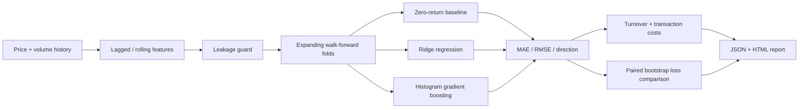

# Financial Time-Series Forecasting

A leakage-aware financial forecasting reference project that compares a **zero-return baseline, regularized linear model and gradient-boosting model** under expanding walk-forward evaluation.

The repository uses a deterministic synthetic, non-stationary price process. The goal is to demonstrate sound evaluation mechanics rather than advertise a profitable trading strategy.

## Architecture



## Forecast target

The target is the **next-period return**, while every predictor is shifted so it uses only data available before that target period. Features include:

- return lags `1, 2, 3, 5, 10, 20`;
- rolling mean and volatility;
- lagged momentum;
- lagged volume change and rolling volume z-score.

`assert_no_target_leakage()` provides a small explicit boundary against known forbidden future-oriented column names. More importantly, the feature construction itself performs the required shifts before rolling calculations.

## Walk-forward evaluation

The models are repeatedly re-fit on an expanding historical window and predict the following fixed-size block. There is no random shuffle split.

Compared models:

- `naive_zero`: predicts zero next-period return;
- `ridge`: standardized linear baseline;
- `gradient_boosting`: nonlinear tree-based model.

Reported forecast metrics:

- MAE;
- RMSE;
- directional accuracy.

The repository also maps predicted sign to a deliberately simple position and reports turnover, transaction-cost-adjusted cumulative return, Sharpe and drawdown. These strategy numbers are diagnostics, **not evidence that forecast error improvements necessarily translate into a viable strategy**.

## Model comparison

`ForecastExperiment.paired_bootstrap_mae_difference()` resamples paired absolute-error differences between gradient boosting and the zero-return baseline. It reports an observed difference and bootstrap interval.

It is explicitly **not labelled a Diebold–Mariano test**. That distinction matters because time-series forecast errors can be serially dependent and a casual statistical-test label would overstate the method implemented here.

## Synthetic non-stationarity

The demo generator changes autocorrelation and volatility across three regimes. This makes the walk-forward procedure face a changing process instead of fitting one stationary Gaussian toy series forever.

## Quick start

```bash
python -m venv .venv
source .venv/bin/activate  # Windows: .venv\Scripts\activate
pip install -r requirements.txt
python -m finforecast.cli --rows 1000 --seed 42 --cost-bps 5
```

Artifacts:

```text
artifacts/forecast_results.json
artifacts/forecast_report.html
```

## API

```bash
uvicorn app.api:app --reload
curl "http://localhost:8000/demo?rows=900&seed=42&cost_bps=5"
```

## Docker

```bash
docker build -t financial-time-series-forecasting .
docker run --rm -p 8000:8000 financial-time-series-forecasting
```

## Tests / CI

```bash
ruff check .
pytest -q
```

CI performs walk-forward tests, a reduced forecasting experiment and a container build.

## What a real-market extension still needs

- point-in-time cleaned market data;
- corporate-action handling;
- richer benchmark models;
- forecast-horizon-specific purging/embargo where labels overlap;
- hyperparameter tuning performed strictly inside historical windows;
- probabilistic forecasts / calibrated intervals;
- realistic execution delay, slippage and market impact;
- regime stability and live-paper evaluation.

These gaps are stated instead of hiding them behind a synthetic Sharpe ratio.

## Portfolio signal

**Python · Pandas · scikit-learn · time-series forecasting · walk-forward validation · leakage prevention · baseline comparison · transaction costs · bootstrap evaluation · FastAPI · Docker · CI/CD**
